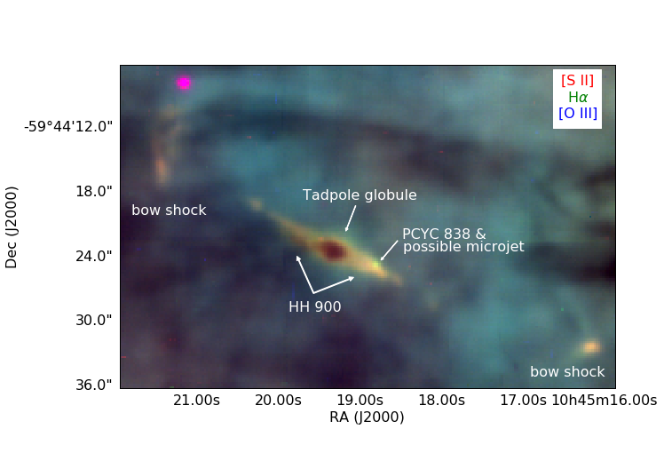
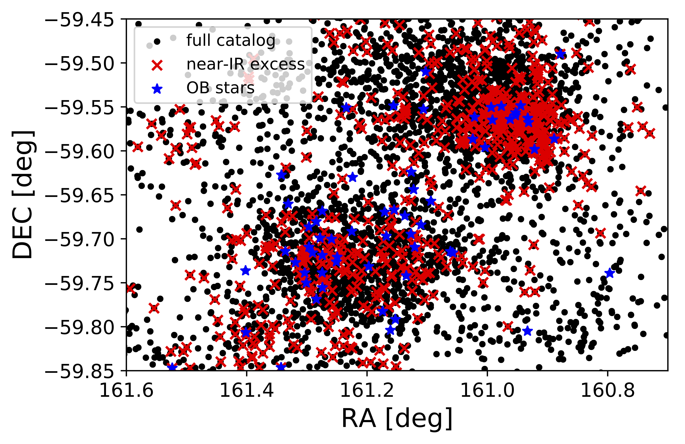
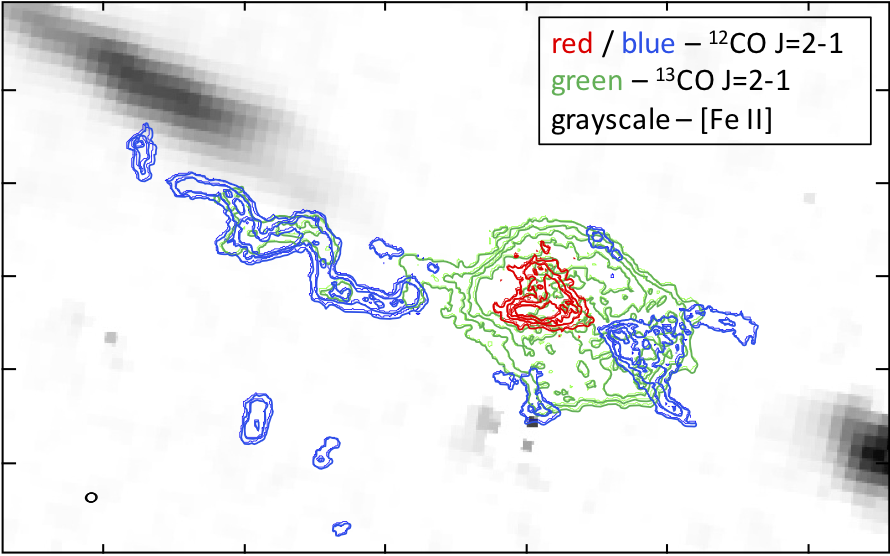

How feedback regulates star formation remains one of the outstanding open questions in astrophysics. My research program uses data from big telescopes on the ground (VLT, Magellan, and ALMA) and space (Hubble and James Webb) to quantify the impact of stellar feedback on the next generation of stars and planets.

The impact of feedback on star and planet formation
======
Most stars form in clusters with hundreds of low-mass stars forming alongside each high-mass star. Stellar feedback permeates these regions, affecting gas and dust in ways that may help or hinder star and planet formation. To determine how feedback affects both individual star-forming cocoons and their natal clouds, I am leading a multi-wavelength study to connect:
(1) the incident ionizing radiation from known population of high-mass stars with
(2) the momentum deposited by photoevaporation and
(3) the resulting kinematics in the cold molecular gas.

The survival and enrichment of planet-forming disks
======
Stars move considerable distances through significantly different environments during their formation (1 pc in 1 Myr at a velocity of 1 km/s). The dynamical evolution of the stellar aggregrates in which most stars are born determines when, what types, and how much feedback affects the nascent stars and their disks, ultimately setting the timescale for planet formation. I am leading a kinematic survey of low-mass stars in high-mass star-forming regions to determine how dynamical evolution determines disk survival.

Surviving protoplanetary disks may be enriched with the nucleosynthetic products of nearby high-mass stars. This includes the short-lived radioactive isotopes thought to play a central role in regulating the water budget of terrestrial planets. I have shown that enrichment studies are ripe for a revisit in light of Galactic chemical evolution studies and improved measurements of the physical properties of high-mass stars.

Jets and outflows
======
One of the enduring problems in measuring feedback from jet+outflow systems is determining the total mass. Fortunately, in young clusters, high-mass stars illuminate and erode the circumstellar environment, revealing atomic gas outside of shock fronts that would otherwise remain invisible. Using this unusual view of common physical processes, I have shown that:
(1) the same physical process governs accretion across the mass range where stellar structure changes, possibly requiring a different approach;
(2) atomic jets have comparable momentum flux to molecular outflows and may contribute significantly to driving cloud turbulence; and
(3) jets are dusty, suggesting launch radii outside the dust sublimation radius.

